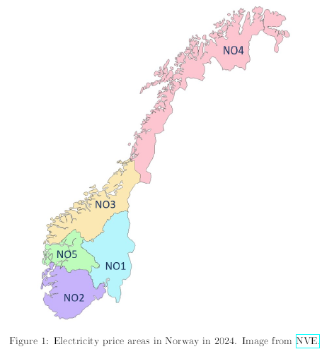
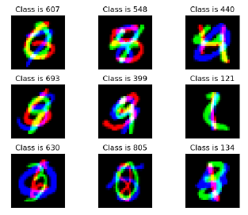

# Deep Learning - it3030 NTNU - Projects
My 3 individual projects from the it3030 deep learning course in NTNU, year 2023-24.
1) Implementing Backpropagation
2) Energy production forecast
3) Deep generative model

### 1 - Implementing Backpropagation
Low-level neural network implementation (without library like Tensorflow or PyTorch). 
Must be with an input layer, 0 to 5 hidden layer and a final optional softmax layer, used for classification problem.
The implementation is in an object-oriented manner. At the very least, the system must include a network and a layer object, and each must have a forward pass and backward pass method.
It includes also L1 and L2 regularization implementation.
The from-scratch-network it's tested on a concrete image classification problem.
The generation of the images for training and testing was required and consiting of basic matrix images containing elementar geometric figure like square, rectangle, circle, triangle.

### 2 - Energy production forecast
The task is to forecast electric power consumption 24 hours ahead, using publicly available historical data about power consumption and weather conditions in different parts of Norway.
Creating forecast models using 3 different neural network architectures, compare the results and
analyze and interpret their strengths and weaknesses.
Preprocessing of date required.
The model I build are:
- feed forward NN
- LSTM
- CNN

### 3 - Deep generative model
Implementation of 2 different models:
- Standard autoencoder
- Varational autoencoder (VAEs)

Each one in form of:
- classifier
- generator
- anomaly detector

Trained and tested on the MNIST dataset.

